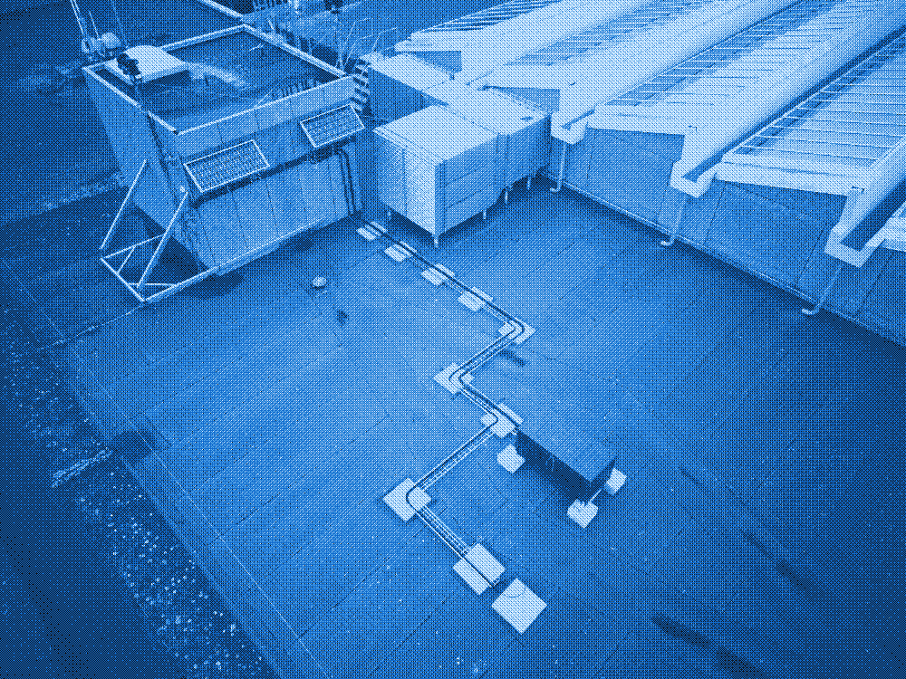

+++
date = '2025-02-12T14:06:47+01:00'
draft = false
title = 'Why?'
summary = " "
url = "/why"
+++
Why a solar powered server on the top of ITU?

When thinking about IT, we often think of limitless and frictionless growth. Most IT and server infrastructures are virtualized, invisibilised and outsourced to such an extent that most people (including IT students) don’t know where their data and server infrastructure physically and materially lives.

The solar-powered server on the rooftop is its own data center, which hosts this website and [a pad for online text editing and collaboration](http://solar.itu.dk/pad). It is a first step in developing more sustainable research infrastructures. If the sun disappears for several days in a row and the compute load is high, the battery will deplete and the server will go offline. How badly the server will be affected by the Danish weather and our compute load is currently an open question, which we will hopefully be able to answer after the website has been online for a few months.

By consciously imposing infrastructural constraints on our work, we are forced to think within limits. What do we do when the server is down? What can we do to ease the compute load? And how do we experience ‘offlineness’ in an era where perpetual ‘onlineness’ is the standard?

